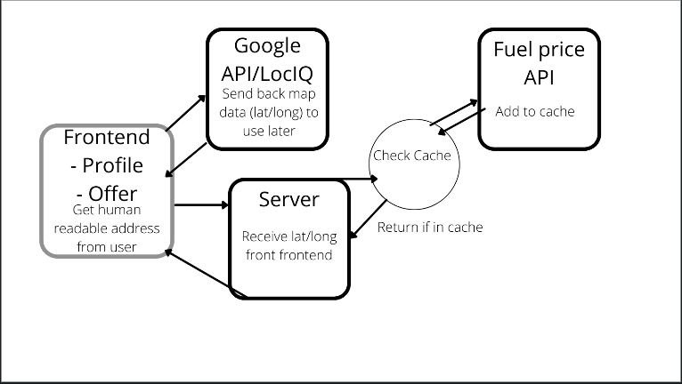
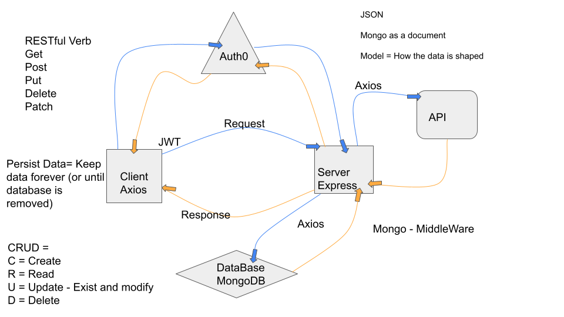
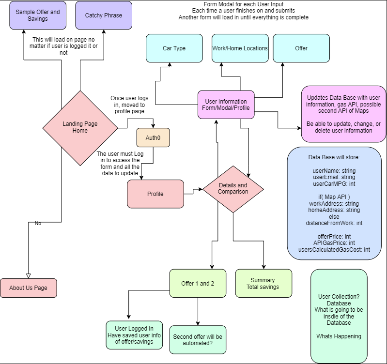
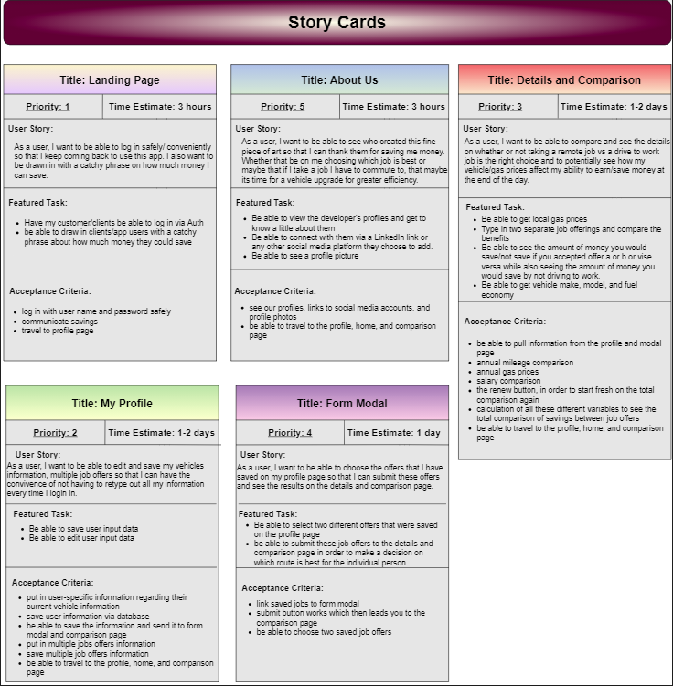
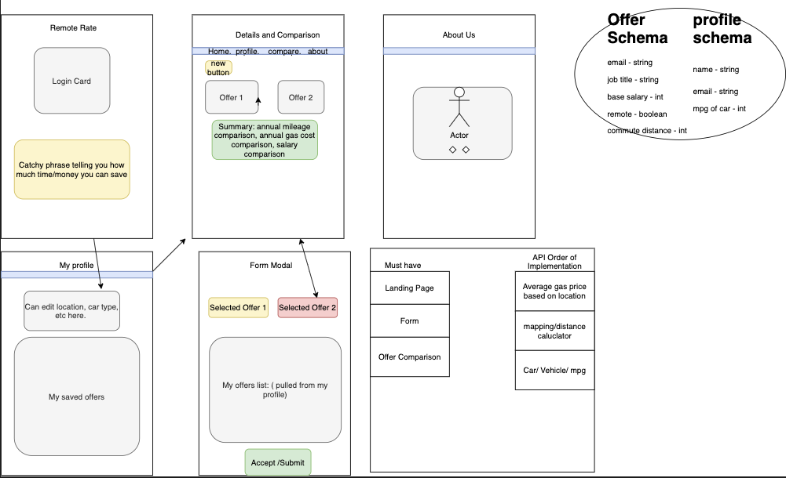

# Remote Rate

## Contributors:

* Charlie Fadness
* Zach Winterton
* Quentin Young
* Phil Murphy

## About This App

Unsure of whether it's worth it to take that job back in the office? Curious how much less you would need to make, to sustain a similar style of living, while working from home? This is the app you've been looking for. Tell us your location, job opportunities, and the MPG of your car, and we'll let you know the cost of commuting, versus staying home

#### [Cooperation Plan](Administrivia/CooperationPlan.md)

#### [Conflict Plan](Administrivia/ConflictPlan.md)

#### [Communication Plan](Administrivia/CommunicationPlan.md)

#### [Work/Git Plan](Administrivia/WorkPlan_Git.md)

## Overview

Our application works with Google Maps API to get the location and uses MongoDB, Node.js, and other tools to help us create our application. With all of these together we are able to get the location of the users inputted home and work, get the distance in between the two locations, calculate the gas cost traveling to work annually, and see the difference between your current pay and offered pay.

## Getting Started
<!-- What are the steps that a user must take in order to build this app on their own machine and get it running? -->

- Pull down/clone from this Repo
- Do `npm i` to install all the nessessary packages inside this react file while in your terminal
- Create a .env file
  - Follow the sample.env for reference
  - Add in your key specific:
    - REACT_APP_AUTH0_DOMAIN=
    - REACT_APP_AUTH0_CLIENT_ID=
    - REACT_APP_BACKEND_SERVER=
    - REACT_APP_GOOGLE_GEOCODE_API=
- Run local host with `npm start`

- [Netlify Link]()

## Architecture
<!-- Provide a detailed description of the application design. What technologies (languages, libraries, etc) you're using, and any other relevant design information. -->

- HTML
- CSS
- JS
- JSON
- GeoLib
- GoogleMapsAPI
- Auth0

<!-- ## Change Log -->

## Credit and Collaborations

- [Auth0 Docs](https://auth0.com/docs)
- [Getting Distance with GeoLib](https://github.com/manuelbieh/geolib)
  - GeoLib has helped us get a distance between two locations.
- [Google Maps GeoCoding](https://developers.google.com/maps/documentation/geocoding/overview)
  - Google Maps API has enabled us to get the exact location of an address when typed in.
- Ryan Galloway
  - Helped us get State running when setState was not working with anything.
- [Netlify](https://www.netlify.com/)

<!-- ## Backend Stuff

[Distance Matrix Response](https://developers.google.com/maps/documentation/distance-matrix/overview#distance-matrix-responses)

This takes in two or more addresses, and returns back the distance between the two and the time it takes to get to that location

Application Start Up Docs -->

## Data Flow

Here we have our Data Flow.In our Data Bases we will use Google Maps API and a gas API. With Google Maps we will be able to grab the home and work address of the user. Google Maps will be able to transfer those into latitude and longitude for us to use into our Gas API. The Gas API will bring back the closest gas station with the price of the gas to use in our application.

Domain Modeling

Story Cards

Wire Frame with Schema

## Data Base

### Data Base will store:

- commuteDist: Number
- curEmployer: String
- curRemote: Boolean
- curSalary: Number
- email: String
- homeLat: String
- homeLon: String
- milesPerGal: Number
- newJob:
  - newCommuteDist: Number
  - newEmployer: String
  - newLocation: String
  - newRemote: Boolean
  - newSalary: Number

## Trello Link

[Trello](https://trello.com/b/zcszi1ZW/remote-rate)

## Things we would have incooporated if time was available:

- API to call a specific Car that had an average MPG for that car Type.
- Being able to change initial user with offers staying
- Having a Gas API that could tell you your average gas in your area
- Calculating the accurate time with traffic to your desination
